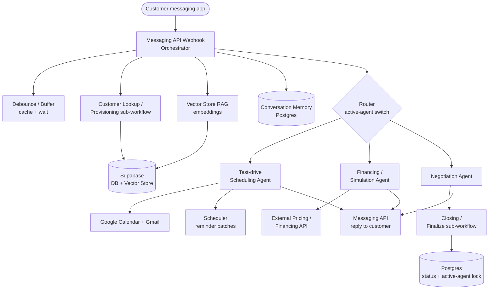

# Dealership Sales Assistant

**A system of cooperating AI agents that runs a car dealership sales journey end to end: it reads an inbound chat message, works out what the customer needs, and hands the conversation to the right specialist agent for vehicle questions, test-drive booking, financing, or price negotiation.**

## The Problem

A car dealership receives a high volume of inbound conversations that span the whole sales journey: first interest, questions about a specific vehicle, booking a test drive, simulating financing, negotiating a price, and closing the deal. Handling each stage by hand is slow, inconsistent, and hard to scale. Context gets lost between stages, and a single monolithic bot cannot reason well across such different tasks while keeping conversation state, scheduling, and deal data in sync.

The hard parts are not the individual replies, they are the seams: keeping one coherent conversation as it moves between very different jobs, never letting two automations talk over each other on the same customer, and not paying for an LLM call on every fragment of a message a customer types across five bubbles.

## The Solution

A set of cooperating agents built on n8n. A central orchestrator ingests customer messages from a messaging API, identifies or creates the customer, debounces bursts of messages into a single turn, and uses retrieval over a vehicle and dealership knowledge base plus conversation memory to answer and route.

When a stage needs a specialist, the orchestrator hands off to a dedicated sub-agent: test-drive scheduling, financing simulation, or negotiation. Each one is its own AI agent with its own tools and database-backed state. A shared "active agent" lock in the database keeps exactly one specialist in control of a conversation at a time, and a closing sub-workflow finalizes the deal status and releases the lock. Shared services, customer lookup and session provisioning, persistent chat memory, and the vector store, are reused across every agent.

| Workflow | Nodes | Role |
|---|---|---|
| Orchestrator / inbound router | 82 | Receives messages, debounces, runs retrieval and memory, routes to a specialist |
| Test-drive scheduling agent | 130 | Calendar slots, email confirmations, batched reminders |
| Financing / simulation agent | 41 | AI agent with a calculator tool calling an external pricing API |
| Negotiation agent | 38 | AI agent with deal state that branches to closing or back to the router |
| Customer lookup / provisioning | 9 | Shared: get-or-create customer by phone, generate a session id |
| Closing / finalize | 3 | Shared: write final status, clear the active-agent lock |

## Architecture

## How It Works

1. A customer message arrives at the orchestrator through the messaging API webhook.
2. The orchestrator calls the customer lookup sub-workflow, which gets or creates the customer by phone and generates a session id for the conversation.
3. Rapid successive messages are coalesced. A wait plus buffer with a Redis-backed lock merges the bursts that chat platforms produce into one turn before any LLM runs.
4. The orchestrator grounds its answer with retrieval: it embeds the message and queries a Supabase vector store for vehicle and dealership knowledge, and it loads per-session chat memory from Postgres.
5. A router reads the active-agent field and decides whether to answer directly or hand off to a specialist.
6. The test-drive agent manages calendar slots, sends email confirmations, and dispatches batched reminders on a schedule.
7. The financing agent calls an external pricing and financing API through a calculator tool, with a cache and lock store and its own conversation memory.
8. The negotiation agent works a price through a fixed offer progression backed by deal state in the database, then branches to closing or back to the orchestrator.
9. The closing sub-workflow writes the final deal status, clears the active-agent lock, and removes the active-deal record so the conversation is free again.

## Engineering Decisions

**Stateful handoff via a database-backed active-agent lock.** The orchestrator routes on an active-agent field, and specialists write deal state to Postgres and Supabase. The closing sub-workflow explicitly clears the active agent and deletes the active-deal row. This single-owner lock stops two agents from acting on the same conversation and gives a clean state machine across sub-workflows.

**Per-conversation memory plus retrieval instead of stateless prompting.** Every agent attaches a Postgres chat-memory node keyed by session, and the orchestrator runs embeddings against a Supabase vector store. This keeps context across the multi-stage journey and grounds answers in dealership and vehicle knowledge rather than relying on the model alone.

**Message debounce and caching before invoking the LLM.** The inbound path uses a wait and buffer plus a Redis store to coalesce rapid successive messages into one turn. That cuts duplicate agent runs and LLM cost while improving response coherence on chat platforms that split a single thought across several messages.

**Decomposition into reusable sub-workflows with idempotent provisioning.** Customer lookup (get-or-create by phone plus a crypto-generated session id) and deal closing are isolated execute-workflow units shared by all agents. Each specialist stays focused, provisioning is idempotent, and side-effecting writes are centralized.

## Result / Impact

- Automates the end-to-end dealership sales conversation, so customers can self-serve through booking, financing, and negotiation at any hour.
- Specialist agents give higher-quality, on-task responses per stage than a single monolithic bot.
- Shared memory and a single active-agent lock keep context and state consistent across handoffs, reducing dropped or duplicated conversations.
- Debounce and caching cut redundant LLM calls and lower per-conversation cost.
- Modular sub-workflows make the system easy to extend with new stages or channels.

_Generalized metrics. Gabriel: drop in real numbers if you have them._

## Stack

- n8n for workflow orchestration
- n8n LangChain nodes for AI agents, tools, memory, and the vector store
- OpenAI for the LLM and embeddings
- Anthropic Claude as an additional LLM
- Supabase for the database and vector store
- PostgreSQL for chat memory and deal / session state
- Redis for cache and debounce locking
- Evolution API for WhatsApp messaging
- Google Calendar, Gmail, and Google Drive
- External HTTP / REST APIs for pricing and financing
- JavaScript in Code nodes for formatting and glue logic

## How to Reproduce

See [docs/setup.md](docs/setup.md) for prerequisites, the credentials you need to provide, and the n8n import steps. All identifiers, prompts, URLs, and contact details in the workflow files are placeholders, so wire in your own services before running.

## Demo

> Placeholder. Drop a short screen capture of a full conversation (inbound message through handoff to a specialist) at `assets/demo.gif`.

---

Built by [Gabriel Fraga](https://github.com/GabrielFragaa), Software & AI Engineer, [LinkedIn](https://www.linkedin.com/in/gabrielfragatech/), [Email](mailto:gabrielfragatech@outlook.com).
